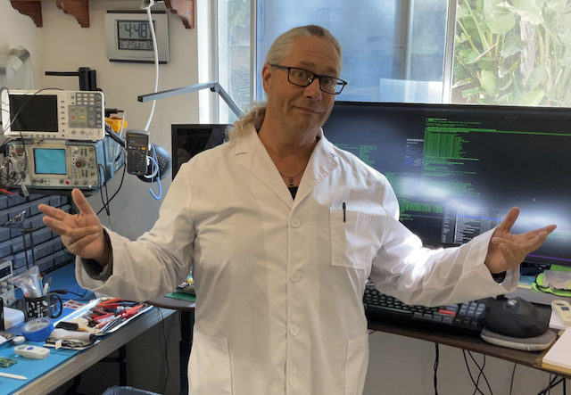

# Welcome to XarkLabs

## XarkLabs is an outlet for Xark's projects

Hi, I'm Xark!

I've been quite lucky to have been an OG game developer (from 1981 to 2023) developing for a bunch of classic computers and video game consoles.

I was first hired to write video games (for the Atari 2600) when I was only 17.  I got a call out of the blue, asking if I would write video games for this company full time.  I had no car, but they offered to pick me up and drop me off each day, so of course I said "yes".

Being in the game industry for so long has been a totally amazing journey.  Now, after 42 years of full time game development I have retired to focus on retro, neo-retro and FPGA projects (along with other pursuits).

I hope to share some highlights and knowledge on [XarkLabs.com](http://XarkLabs.com) and on [XarkLabs YouTube channel](http://youtube.com/@XarkLabs) (content coming soon [*yikes...*]).

## Xark's Project Links (Software, Electronics and FPGAs)

[XarkLabs's GitHub Page](https://github.com/XarkLabs) - Some open projects I have worked on.

[Xark's HackADay.io Page](https://hackaday.io/Xark) - Details about open projects (and some articles).

## Xark's (aka Ken Jordan's) Game Dev Links

[A note about retiring after 42 years as a game developer](https://hackaday.io/page/21309-42-years-experiencing-life-the-universe-and-game-development) - The companies I have worked for.

## About Xark

Xark (also known as Ken Jordan) currently lives in Southern California with his two cats (Pixie and Buddy).

## Contact

If you would like to contact Xark, you can email <Xark@XarkLabs.com>, or find me on Discord as `true_xark`.
